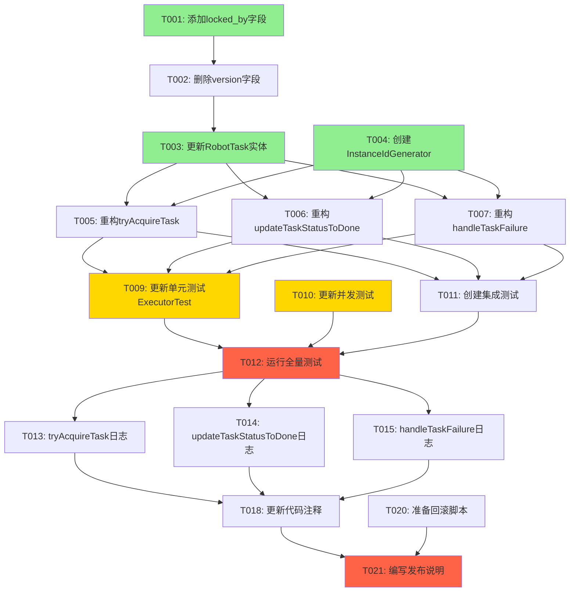

# 任务清单：任务抢占机制从乐观锁改为声明式领取

**功能分支**: `006-replace-optimistic-lock-claim`  
**规范文档**: [spec.md](./spec.md) | **实施计划**: [plan.md](./plan.md)  
**预估工作量**: 12-16小时

## 概述

本功能将任务抢占机制从乐观锁（version字段）改为声明式领取（locked_by字段），解决LLM长时调用场景下因并发写操作导致的版本冲突问题。

### 用户故事映射

- **US1** (P1): 任务领取不受长时操作影响
- **US2** (P1): 移除版本字段及相关逻辑
- **US3** (P2): 任务失败重试保持所有权

### MVP 范围

MVP包含US1和US2（P1优先级），确保核心功能可用。US3为增强功能，可后续迭代。

## 实施策略

### 增量交付原则

1. **阶段1-2（基础设施）**: 完成后即可进行基础验证
2. **阶段3（US1+US2）**: 完成后交付核心MVP，可独立部署和测试
3. **阶段4（US3）**: 增强容错能力，独立交付
4. **阶段5（优化）**: 提升可观测性和运维友好度

### 并行执行建议

- 阶段1: T001-T003可以并行（不同文件）
- 阶段2: T004可与T005-T007并行开发（独立模块）
- 阶段3: T009和T010可并行（不同测试文件）
- 阶段4: T013-T015可并行（不同方法的日志增强）

## 阶段 1：基础设施准备

**目标**: 完成数据库schema变更和实体类更新

**独立测试标准**: 应用启动成功，数据库表结构正确，RobotTask实体可正常序列化/反序列化

### 数据库迁移

- [ ] T001 [P] 在 `src/main/resources/datasourceInit.sql` 中添加 `locked_by` 字段
  - 位置：在所有现有 robot_task 表相关脚本之后
  - SQL: `ALTER TABLE robot_task ADD COLUMN locked_by VARCHAR(255) DEFAULT NULL COMMENT '领取任务的实例ID，用于验证所有权';`
  - 验证：启动应用后执行 `DESCRIBE robot_task` 检查字段存在

- [ ] T002 在 `src/main/resources/datasourceInit.sql` 中删除 `version` 字段
  - SQL: `ALTER TABLE robot_task DROP COLUMN version;`
  - 注意：确保在 T001 之后执行
  - 验证：执行 `DESCRIBE robot_task` 确认 version 列不存在

### 实体类更新

- [ ] T003 [P] 更新 `src/main/java/com/bqsummer/common/dto/robot/RobotTask.java`
  - 移除 `@Version` 注解
  - 移除 `private Integer version;` 字段
  - 新增 `private String lockedBy;` 字段（驼峰命名，MyBatis Plus自动映射）
  - 验证：执行 `mvn compile` 确保编译通过

## 阶段 2：核心实现（阻塞性基础）

**目标**: 实现实例ID生成器和任务执行器的核心方法重构

**独立测试标准**: InstanceIdGenerator返回有效ID，任务领取/完成/失败方法的单元测试通过

### 实例ID工具类

- [ ] T004 [P] 创建 `src/main/java/com/bqsummer/util/InstanceIdGenerator.java`
  - 实现静态方法 `public static String getInstanceId()`
  - 使用 `InetAddress.getLocalHost().getHostName()` + `ManagementFactory.getRuntimeMXBean().getName()` 获取pid
  - 格式：`hostname:pid`
  - 降级策略：异常时返回 `UUID.randomUUID().toString()`
  - 添加中文注释说明实例ID生成逻辑
  - 验证：创建简单测试验证ID格式正确

### RobotTaskExecutor 重构

- [ ] T005 [US1] [US2] 重构 `src/main/java/com/bqsummer/service/robot/RobotTaskExecutor.java` 中的 `tryAcquireTask()` 方法
  - 移除 `eq("version", task.getVersion())` 条件
  - 移除 `set("version", task.getVersion() + 1)` 操作  
  - 新增 `set("locked_by", InstanceIdGenerator.getInstanceId())`
  - 保持 `eq("status", TaskStatus.PENDING.name())` 条件
  - 更新方法注释：说明使用声明式领取机制
  - 验证：方法编译通过，逻辑正确

- [ ] T006 [US1] [US2] 重构 `src/main/java/com/bqsummer/service/robot/RobotTaskExecutor.java` 中的 `updateTaskStatusToDone()` 方法
  - 移除 `eq("version", task.getVersion())` 条件
  - 移除 `set("version", task.getVersion() + 1)` 操作
  - 新增 `eq("locked_by", InstanceIdGenerator.getInstanceId())` 条件验证所有权
  - 更新方法注释：说明基于locked_by验证所有权
  - 验证：方法编译通过，逻辑正确

- [ ] T007 [US3] 重构 `src/main/java/com/bqsummer/service/robot/RobotTaskExecutor.java` 中的 `handleTaskFailure()` 方法
  - 移除所有 `eq("version", task.getVersion())` 条件
  - 移除所有 `set("version", task.getVersion() + 1)` 操作
  - 在重试场景（retryCount < maxRetryCount）中新增 `set("locked_by", null)` 清空所有权
  - 在失败场景（retryCount >= maxRetryCount）中新增 `set("locked_by", null)`
  - 更新方法注释：说明失败重试时释放所有权
  - 验证：方法编译通过，逻辑正确

### 超时任务清理增强（可选）

- [ ] T008 [P] 在 `src/main/java/com/bqsummer/job/RobotTaskLoaderJob.java` 中增强超时任务清理逻辑
  - 查找加载超时RUNNING任务的代码位置
  - 在重新加载超时任务时，添加清空 locked_by 的逻辑
  - 使用 `set("locked_by", null)` 或在SQL中添加 `locked_by=NULL`
  - 验证：超时任务能被重新领取

## 阶段 3：测试覆盖（US1 + US2 验证）

**目标**: 更新现有测试并新增集成测试，验证声明式领取机制正确性

**独立测试标准**: 所有单元测试和集成测试通过，无version相关错误

### 单元测试更新

- [ ] T009 [P] [US1] [US2] 更新 `src/test/java/com/bqsummer/service/robot/RobotTaskExecutorTest.java`
  - 查找并移除所有 version 相关的断言（如 `assertEquals(expectedVersion, task.getVersion())`）
  - 查找并移除所有 version 相关的 mock 设置
  - 新增 locked_by 相关断言验证
  - 新增测试用例：`testUpdateTaskStatusToDone_NonOwner_ShouldFail()` 验证非所有者无法更新
  - 更新测试中的@DisplayName为中文
  - 验证：执行 `mvn test -Dtest=RobotTaskExecutorTest` 确保所有测试通过

- [ ] T010 [P] [US1] [US2] 更新 `src/test/java/com/bqsummer/service/robot/RobotTaskSchedulerConcurrencyTest.java`
  - 检查是否有 version 相关的测试代码
  - 如果有，移除并替换为 locked_by 验证逻辑
  - 确保并发测试仍然有效
  - 验证：执行测试确保通过

### 集成测试

- [ ] T011 [US1] [US2] 创建 `src/test/java/com/bqsummer/integration/RobotTaskClaimIntegrationTest.java`
  - 继承 `BaseTest` 使用Spring Boot测试环境
  - 测试1：多实例并发领取 - 创建PENDING任务，模拟2个实例ID同时调用tryAcquireTask，验证只有1个成功（affected=1）
  - 测试2：心跳更新不影响完成 - 领取任务后模拟心跳更新heartbeat_at，验证updateTaskStatusToDone仍能成功
  - 测试3：非所有者更新失败 - 实例A领取任务，实例B尝试更新状态，验证失败
  - 测试4：失败重试清空locked_by - 模拟任务执行失败，验证locked_by被清空且状态变为PENDING
  - 所有测试使用@DisplayName中文注解
  - 使用@Transactional确保测试隔离
  - 验证：执行测试确保全部通过

- [ ] T012 运行全量测试套件验证
  - 执行 `mvn clean test` 运行所有测试
  - 检查测试报告，确保所有测试通过
  - 检查日志输出，确认无 version 相关的错误或警告
  - 验证：测试通过率100%

## 阶段 4：增强功能（US3 + 优化）

**目标**: 提升系统可观测性和运维友好度

**独立测试标准**: 日志包含关键信息，便于问题排查

### 日志增强

- [ ] T013 [P] [US1] 在 `src/main/java/com/bqsummer/service/robot/RobotTaskExecutor.java` 的 `tryAcquireTask()` 中增强日志
  - 领取成功时：记录 `log.info("任务领取成功: taskId={}, instanceId={}, status={}", taskId, instanceId, status)`
  - 领取失败时：记录 `log.warn("任务领取失败: taskId={}, expectedStatus=PENDING, reason=已被其他实例领取或状态已变更", taskId)`
  - 验证：查看日志输出格式正确

- [ ] T014 [P] [US1] 在 `src/main/java/com/bqsummer/service/robot/RobotTaskExecutor.java` 的 `updateTaskStatusToDone()` 中增强日志
  - 更新成功时：记录任务ID、实例ID、执行时长
  - 更新失败时：记录 `log.error("任务状态更新失败，所有权验证失败: taskId={}, currentInstanceId={}", taskId, instanceId)`
  - 验证：查看日志输出格式正确

- [ ] T015 [P] [US3] 在 `src/main/java/com/bqsummer/service/robot/RobotTaskExecutor.java` 的 `handleTaskFailure()` 中增强日志
  - 清空 locked_by 时：记录 `log.warn("任务失败重试，释放所有权: taskId={}, previousLockedBy={}, nextScheduledAt={}", taskId, lockedBy, nextExecuteAt)`
  - 达到最大重试次数时：记录失败原因和locked_by清理
  - 验证：查看日志输出格式正确

### 监控指标（可选）

- [ ] T016 [P] 添加领取冲突计数器到 `src/main/java/com/bqsummer/service/robot/RobotTaskExecutor.java`
  - 在tryAcquireTask失败时增加计数
  - 使用 Micrometer 或 Prometheus 客户端
  - 指标名称：`robot_task_claim_conflicts_total`
  - 标签：`action_type`
  - 验证：查看指标端点是否输出

- [ ] T017 [P] 添加所有权验证失败计数器到 `src/main/java/com/bqsummer/service/robot/RobotTaskExecutor.java`
  - 在updateTaskStatusToDone因locked_by不匹配失败时增加计数
  - 指标名称：`robot_task_ownership_violations_total`
  - 标签：`action_type`
  - 验证：查看指标端点是否输出

## 阶段 5：文档和发布

**目标**: 更新文档和准备发布

**独立测试标准**: 文档准确反映当前实现，回滚脚本可用

### 文档更新

- [ ] T018 [P] 更新 `src/main/java/com/bqsummer/service/robot/RobotTaskExecutor.java` 中的代码注释
  - 类注释：说明"使用声明式领取机制（locked_by字段）替代乐观锁（version字段）"
  - tryAcquireTask 方法注释：说明"基于 locked_by 的所有权机制，原子UPDATE保证互斥"
  - 查找并移除所有提及"乐观锁"或"version"的注释
  - 验证：代码审查确认注释准确

- [ ] T019 更新 `.github/copilot-instructions.md`
  - 在 Recent Changes 区域已由plan阶段更新完成
  - 验证变更已记录：006-replace-optimistic-lock-claim相关内容
  - 验证：查看文件确认更新正确

### 发布准备

- [ ] T020 [P] 准备回滚脚本 `specs/006-replace-optimistic-lock-claim/rollback-006.sql`
  - 内容：`ALTER TABLE robot_task ADD COLUMN version INT DEFAULT 0 NOT NULL;`
  - 内容：`ALTER TABLE robot_task DROP COLUMN locked_by;`
  - 内容：`-- 回滚后需要恢复RobotTask.java中的@Version注解和version字段`
  - 验证：在测试数据库执行回滚脚本，确认可以成功回滚

- [ ] T021 编写发布说明 `specs/006-replace-optimistic-lock-claim/RELEASE_NOTES.md`
  - 说明变更内容：任务抢占机制从乐观锁改为声明式领取
  - 说明原因：解决LLM长时调用场景下的版本冲突问题
  - 说明潜在影响：无API变更，数据库schema自动迁移
  - 提供回滚步骤：执行rollback-006.sql并恢复代码
  - 监控建议：关注任务执行成功率、领取冲突次数
  - 验证：团队审阅发布说明

## 依赖关系图



**图例**：
- 绿色：基础设施（可并行）
- 黄色：测试任务（部分可并行）
- 红色：关键验证点

## 并行执行示例

### 阶段 1 并行执行

```bash
# 终端1：数据库迁移
vim src/main/resources/datasourceInit.sql  # T001 + T002

# 终端2：实体类更新（可并行）
vim src/main/java/com/bqsummer/common/dto/robot/RobotTask.java  # T003
```

### 阶段 2 并行执行

```bash
# 终端1：创建工具类（独立）
vim src/main/java/com/bqsummer/util/InstanceIdGenerator.java  # T004

# 终端2：重构Executor（依赖T003完成）
vim src/main/java/com/bqsummer/service/robot/RobotTaskExecutor.java  # T005-T007
```

### 阶段 3 并行执行

```bash
# 终端1：更新单元测试
vim src/test/java/com/bqsummer/service/robot/RobotTaskExecutorTest.java  # T009

# 终端2：更新并发测试（可并行）
vim src/test/java/com/bqsummer/service/robot/RobotTaskSchedulerConcurrencyTest.java  # T010

# 终端3：创建集成测试（可并行）
vim src/test/java/com/bqsummer/integration/RobotTaskClaimIntegrationTest.java  # T011
```

### 阶段 4 并行执行

```bash
# 三个日志增强任务可以并行（不同方法）
# T013: tryAcquireTask日志
# T014: updateTaskStatusToDone日志
# T015: handleTaskFailure日志
```

## 验收检查清单

### 功能验收

- [ ] ✅ 数据库表结构正确（有 locked_by VARCHAR(255)，无 version）
- [ ] ✅ RobotTask 实体类正确（有 lockedBy，无 version 和 @Version）
- [ ] ✅ InstanceIdGenerator 返回格式为 `hostname:pid` 的实例ID
- [ ] ✅ 所有代码中不再包含 version 字段相关逻辑
- [ ] ✅ tryAcquireTask 使用 `WHERE status='PENDING'` 且设置 locked_by
- [ ] ✅ updateTaskStatusToDone 验证 `WHERE locked_by=?`
- [ ] ✅ handleTaskFailure 在重试时清空 locked_by

### 测试验收

- [ ] ✅ 所有单元测试通过（RobotTaskExecutorTest）
- [ ] ✅ 所有并发测试通过（RobotTaskSchedulerConcurrencyTest）
- [ ] ✅ 所有集成测试通过（RobotTaskClaimIntegrationTest）
- [ ] ✅ 全量测试套件通过（mvn clean test）
- [ ] ✅ 多实例并发领取测试：只有一个实例成功
- [ ] ✅ LLM长时调用场景测试：任务能成功完成
- [ ] ✅ 心跳并发写场景测试：不影响任务完成
- [ ] ✅ 任务失败重试测试：locked_by被清空

### 质量验收

- [ ] ✅ 代码编译通过（mvn compile）
- [ ] ✅ 无编译警告
- [ ] ✅ 日志包含关键操作信息（领取、完成、失败）
- [ ] ✅ 日志格式正确，包含必要上下文（taskId, instanceId）
- [ ] ✅ 代码注释准确，无"乐观锁"或"version"相关描述
- [ ] ✅ @DisplayName使用中文
- [ ] ✅ @Transactional注解保持正确

### 发布验收

- [ ] ✅ 回滚脚本已准备并测试
- [ ] ✅ 发布说明完整且准确
- [ ] ✅ copilot-instructions.md已更新
- [ ] ✅ 团队已审阅变更内容

## 预估工作量

| 阶段 | 任务编号 | 任务数 | 预估时间 | 可并行 |
|------|---------|-------|---------|--------|
| 阶段1：基础设施 | T001-T003 | 3 | 2小时 | T001+T003可并行 |
| 阶段2：核心实现 | T004-T008 | 5 | 4-6小时 | T004可与T005-T007并行 |
| 阶段3：测试覆盖 | T009-T012 | 4 | 4-6小时 | T009-T011可并行 |
| 阶段4：增强功能 | T013-T017 | 5 | 2-3小时 | T013-T015可并行 |
| 阶段5：文档发布 | T018-T021 | 4 | 1-2小时 | T018+T020可并行 |
| **总计** | **T001-T021** | **21** | **13-19小时** | **7-8小时（并行）** |

### 关键路径（串行必须）

T001 → T002 → T003 → T005 → T009 → T012 → T018 → T021

**关键路径时间**：约8-10小时

### 建议实施时间表

- **Day 1 上午（2-3小时）**：阶段1 + 阶段2部分（T001-T004）
- **Day 1 下午（3-4小时）**：阶段2完成（T005-T008）
- **Day 2 上午（3-4小时）**：阶段3（T009-T012）
- **Day 2 下午（2-3小时）**：阶段4（T013-T017）
- **Day 2 晚上或Day 3（1-2小时）**：阶段5（T018-T021）

**总计**：2-3个工作日完成

## 成功标准映射

| 成功标准 | 验证任务 | 验收标准 |
|---------|---------|---------|
| SC-001: LLM长时调用成功率100% | T011测试2 | 模拟30秒LLM调用，任务成功完成 |
| SC-002: 无任务重复执行 | T011测试1 | 多实例并发，只有1个领取成功 |
| SC-003: 并发写不影响完成 | T011测试2 | 心跳更新后仍能完成任务 |
| SC-004: 现有测试通过 | T012 | 全量测试通过率100% |
| SC-005: 无version相关错误 | T009, T012 | 日志和测试输出无version错误 |
| SC-006: 自动执行迁移 | T001, T002 | 应用启动后表结构正确 |
| SC-007: 重试成功率 | T011测试4 | 失败重试后能重新领取 |

---

**任务清单版本**: v1.0  
**最后更新**: 2025-10-24  
**下一步**: 执行 `/speckit.implement` 开始实施
